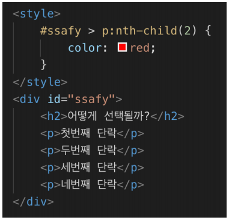

# 10 workshop

#### 아래의 코드를 작성하여 몇 번째 단락이 빨간색으로 변하는지 확인해보자.

#### 생각하는 대로 선택되는가? 이번에는 nth-child 대신 nth-of-type를 사용해보고 몇 번째 단락이 파란색으로 변하는지 확인해보자.

- p: nth-child(2) 는 첫번째 단락이 red로 변했고

  위에서부터 순서대로 다 찾고 그 친구가 p이면 색상을 바꾸고 아니면 안바꾼다.

- p:nth-of-type(2) 는 두번째 단락이 blue로 변했다.

  p type중에서 2번째를 찾는다.

